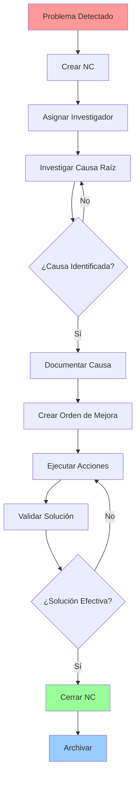
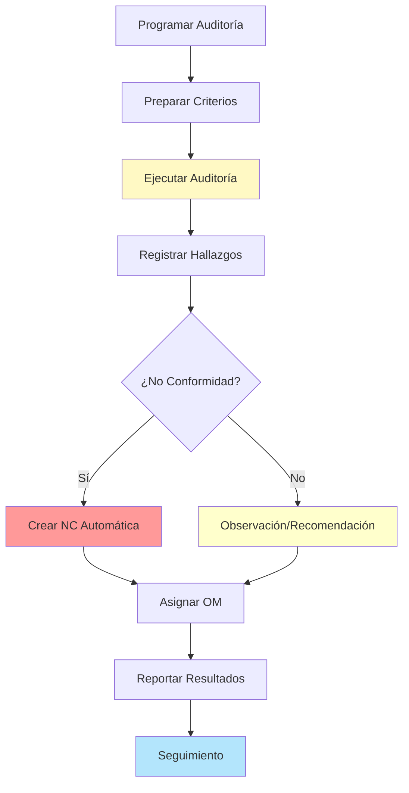
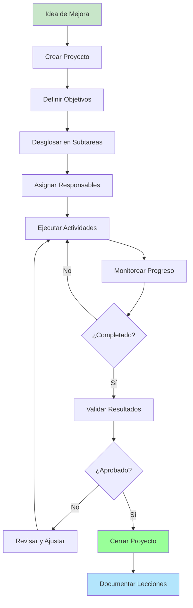
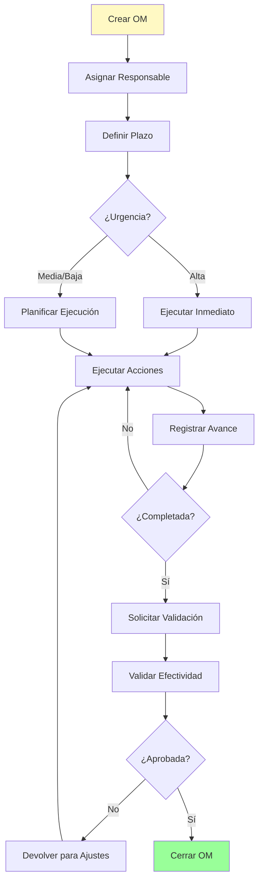
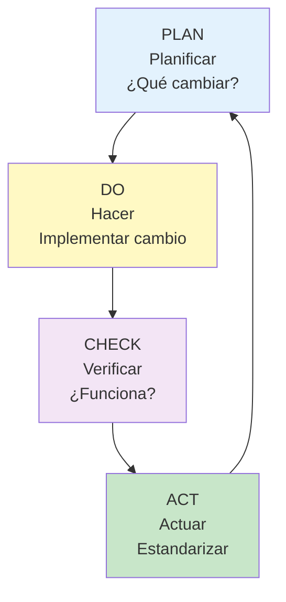
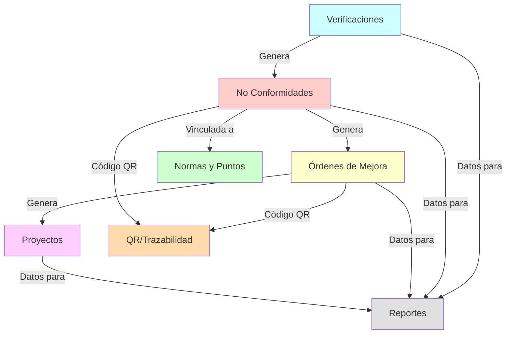
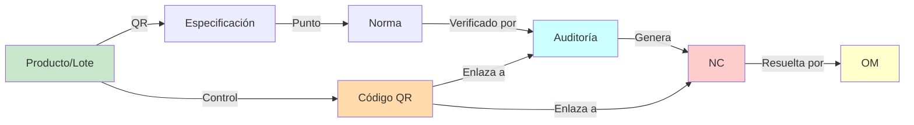

# Diagramas de Flujo

## Flujo General de No Conformidades

## Flujo de Auditoría y Generación de NC

## Flujo de Proyecto de Mejora

## Flujo de Órdenes de Mejora

## Ciclo de Mejora Continua (PDCA)

## Integración entre Módulos

## Matriz de Trazabilidad

---

[← Volver al inicio](./index.md)
